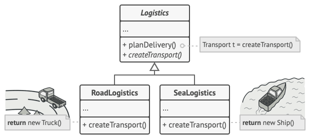
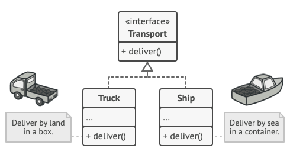
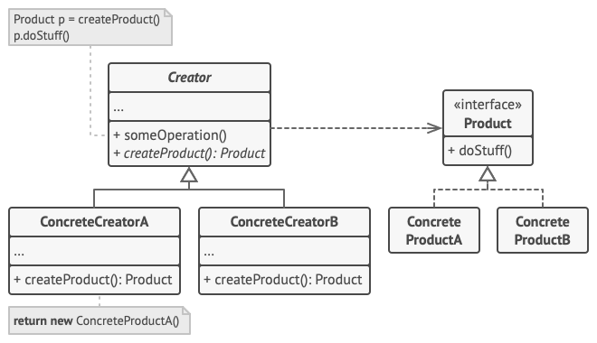

The Factory Method pattern suggests that you replace direct object
construction calls (using the new operator)with calls to a special 
factory method. Don’t worry: the objects are still created via the new operator, but it’s being called from within
the factory method. Objects returned by a factory method are often referred to as products.

 Subclasses may return different types of products only if these products have a common base class or interface. Also, the factory method in the base class should have its return type declared as this interface.

<h1>Structure</h1>

<h6>Step1</h6>
The Product declares the interface, which is common to all objects that can be produced by the creator and its subclasses.

<h6>Ste2</h6>
Concrete Products are different implementations of the product interface.
<h6>Step3</h6>
The Creator class declares the factory method that returns new product objects. It’s important that the return type of this method matches the product interface.
    
You can declare the factory method as abstract to force all subclasses to implement their own versions of the method. As an alternative, the base factory method can return some default product type.
<h6>Step4</h6>
Concrete Creators override the base factory method so it returns a different type of product.

